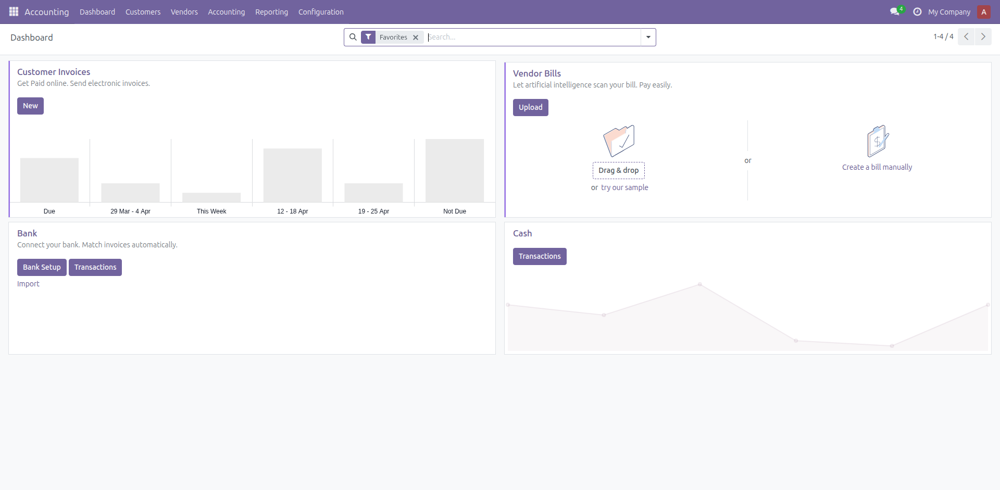
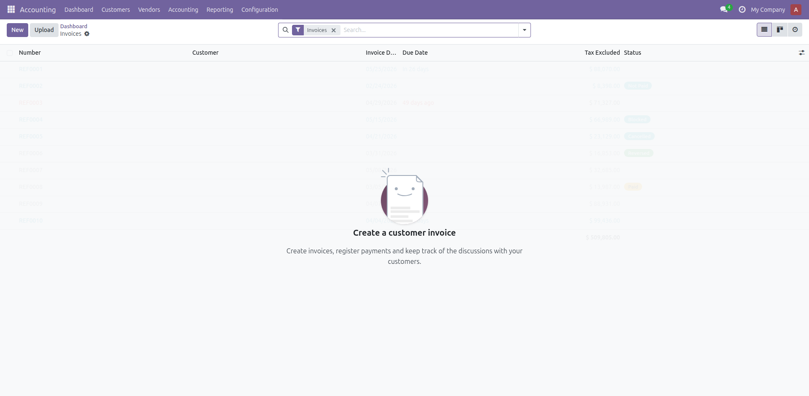
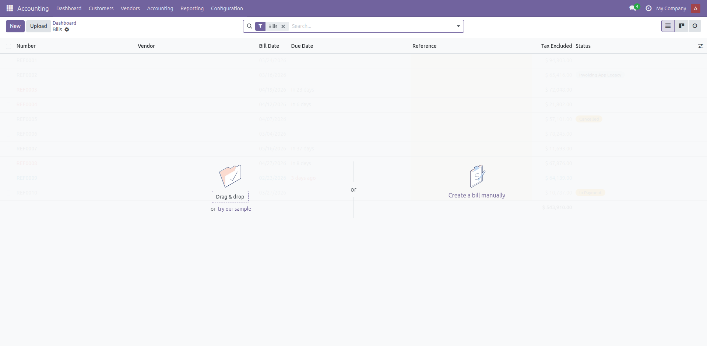
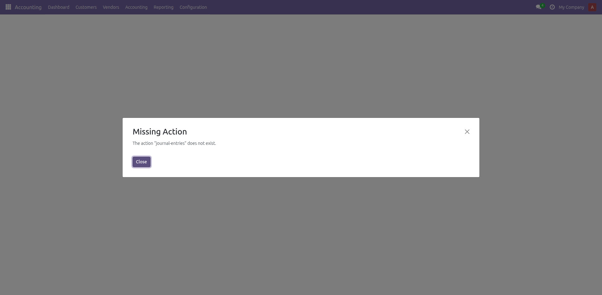
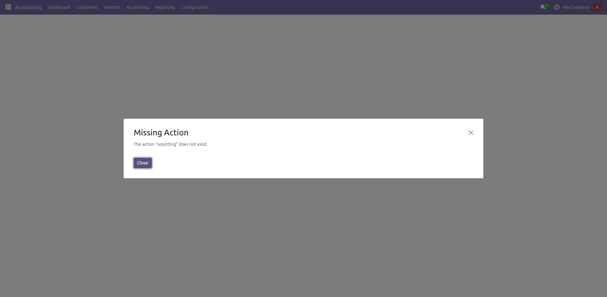
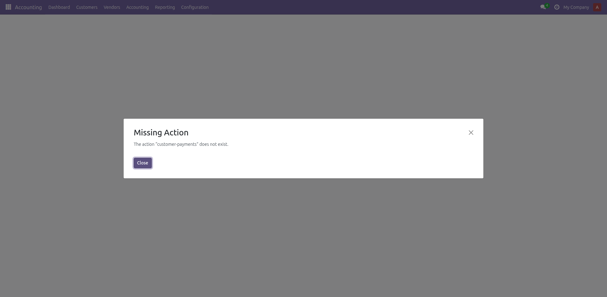
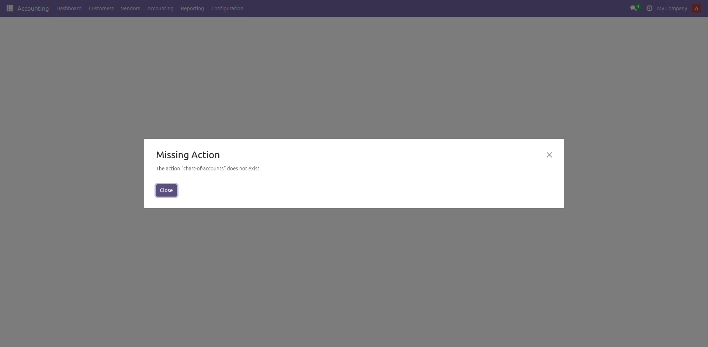
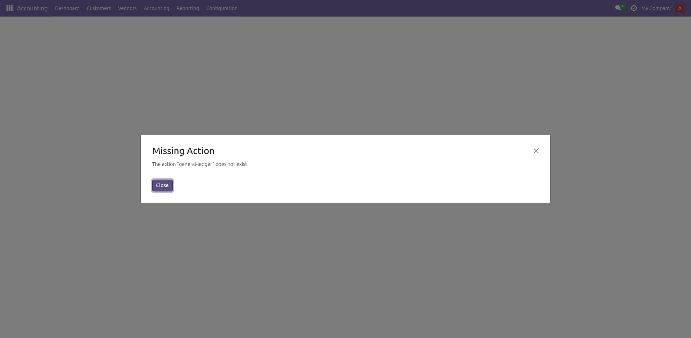
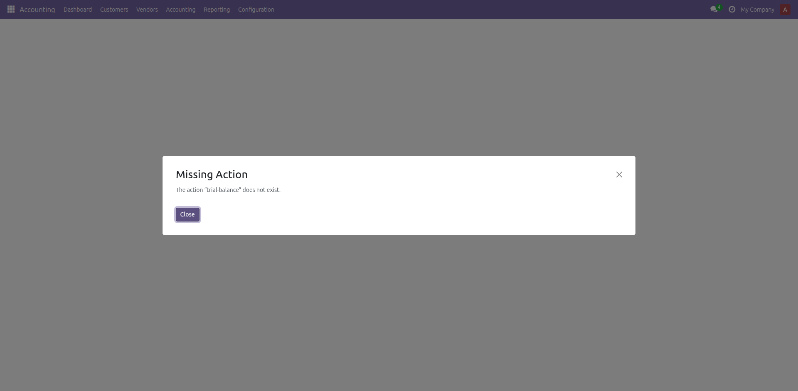

<p align="center">
  
</p>

<h1 align="center">Woow Odoo Accounting Enhancement Package</h1>

<p align="center">
  <strong>Production-Ready Full Accounting Kit for Odoo 18 Community Edition</strong><br/>
  Enhanced, security-hardened, and comprehensively tested accounting modules with 36 code fixes and 69 test cases
</p>

<p align="center">
  <a href="#features">Features</a> &bull;
  <a href="#architecture">Architecture</a> &bull;
  <a href="#installation">Installation</a> &bull;
  <a href="#modules">Modules</a> &bull;
  <a href="#screenshots">Screenshots</a> &bull;
  <a href="#security-enhancements">Security</a> &bull;
  <a href="#testing">Testing</a> &bull;
  <a href="#changelog">Changelog</a> &bull;
  <a href="README_zh-TW.md">中文文件</a>
</p>

<p align="center">
  
  
  
  
  
  
</p>

---

## Overview

**Woow Odoo Accounting Enhancement Package** is a fully reviewed, security-hardened, and production-ready accounting suite for Odoo 18 Community Edition. Built on top of the popular `base_accounting_kit` module by Cybrosys Technologies, this package includes **36 critical code fixes** across security vulnerabilities, deprecated API calls, and compatibility issues — all verified by a comprehensive **69-test-case automated test suite** covering **20 different categories**.

<p align="center">
  
</p>

### Why This Package?

| Challenge | Solution |
|-----------|----------|
| Original module has SQL injection vulnerabilities | All raw SQL queries parameterized with proper escaping |
| XSS vulnerabilities in reports and controllers | MarkupSafe escaping applied to all user-facing HTML output |
| Deprecated Odoo API calls (`post()`) | Updated to modern `action_post()` across all models |
| Missing CSRF protection on endpoints | CSRF tokens enforced on all web controllers |
| Hardcoded currency defaults (USD) | Dynamic company currency resolution |
| Legacy OWL JavaScript imports | Modernized to Odoo 18 ES module import syntax |
| No automated testing | 69 test cases across 20 categories with 100% pass rate |
| Incomplete access control | Security rules and model access properly configured |

---

## Features

### Comprehensive Accounting Modules

- **Full Accounting Kit** — Complete accounting management including journals, invoices, payments, reconciliation
- **Asset Management** — Track fixed assets with depreciation schedules, categories, and disposal workflows
- **Budget Management** — Create and monitor budgets with analytical account integration
- **Bank Reconciliation** — Advanced bank statement reconciliation with custom widgets
- **Financial Reports** — Profit & Loss, Balance Sheet, Trial Balance, General Ledger, and more
- **Recurring Payments** — Automated recurring journal entries with cron-based scheduling
- **Post-Dated Cheques (PDC)** — Full PDC lifecycle management for issued and received cheques
- **Customer Follow-ups** — Automated follow-up levels with configurable reminders
- **Credit Limit** — Partner credit limit monitoring and enforcement
- **Cash Flow Reports** — Comprehensive cash flow analysis and reporting
- **Day/Bank/Cash Book** — Detailed daily transaction registers and books
- **Multiple Invoice Layouts** — Customizable invoice templates and print formats
- **Bank Statement Import** — Support for OFX, QIF, and CSV bank statement formats

### Security Enhancements (12 Fixes)

- **SQL Injection Protection** — All raw SQL queries parameterized (`res_partner.py`)
- **XSS Prevention** — HTML output escaped with MarkupSafe (`res_partner.py`, `ListController.js`)
- **CSRF Token Enforcement** — All HTTP endpoints protected (`statement_report.py`)
- **JavaScript XSS Guards** — DOM manipulation uses safe escaping utilities (`ListController.js`)
- **Access Control** — Proper security groups and model access rules

### API Modernization (8 Fixes)

- **`post()` → `action_post()`** — Updated across `account_move.py`, `account_asset_depreciation_line.py`, `recurring_payments.py`, `account_payment.py`
- **Company currency resolution** — Dynamic instead of hardcoded USD (`account_asset_category.py`)
- **OWL import modernization** — ES module syntax for Odoo 18 (`bank_reconcile_form_lines_widget.js`, `bank_reconcile_form_list_widget.js`)

---

## Architecture

```
┌─────────────────────────────────────────────────────────────────┐
│           Woow Odoo Accounting Enhancement Package              │
├─────────────────────────────────────────────────────────────────┤
│                                                                  │
│  ┌──────────────────────────────────────────────────────────┐   │
│  │              base_accounting_kit (v18.0.5.0.8)           │   │
│  │                                                          │   │
│  │  ┌──────────────┐  ┌──────────────┐  ┌──────────────┐   │   │
│  │  │   Assets     │  │   Reports    │  │  Payments    │   │   │
│  │  │              │  │              │  │              │   │   │
│  │  │ • Categories │  │ • P&L        │  │ • Recurring  │   │   │
│  │  │ • Deprec.    │  │ • Balance    │  │ • PDC        │   │   │
│  │  │ • Disposal   │  │ • Ledger     │  │ • Bank Rec.  │   │   │
│  │  └──────────────┘  │ • Trial Bal. │  │ • Statements │   │   │
│  │                     │ • Cash Flow  │  └──────────────┘   │   │
│  │  ┌──────────────┐  │ • Day Book   │  ┌──────────────┐   │   │
│  │  │  Follow-ups  │  └──────────────┘  │  Invoicing   │   │   │
│  │  │              │                     │              │   │   │
│  │  │ • Levels     │  ┌──────────────┐  │ • Layouts    │   │   │
│  │  │ • Reminders  │  │ Credit Limit │  │ • Multi-fmt  │   │   │
│  │  │ • Reports    │  └──────────────┘  │ • Import     │   │   │
│  │  └──────────────┘                     └──────────────┘   │   │
│  └──────────────────────────┬───────────────────────────────┘   │
│                              │                                   │
│  ┌──────────────────────────▼───────────────────────────────┐   │
│  │           base_account_budget (v18.0.1.0.0)              │   │
│  │                                                          │   │
│  │  • Budget definitions with analytic accounts             │   │
│  │  • Budget lines with planned vs actual tracking          │   │
│  │  • Budget confirmation/approval workflow                 │   │
│  │  • Multi-company budget isolation                        │   │
│  └──────────────────────────┬───────────────────────────────┘   │
│                              │                                   │
├──────────────────────────────┼───────────────────────────────────┤
│                              ▼                                   │
│  ┌───────────────────────────────────────────────────────────┐   │
│  │                    Odoo 18 Framework                       │   │
│  │  account │ sale │ analytic │ account_check_printing        │   │
│  └───────────────────────────────────────────────────────────┘   │
│                              │                                   │
│  ┌───────────────────────────▼───────────────────────────────┐   │
│  │                     PostgreSQL                             │   │
│  │          Accounting Data │ Asset Records │ Budgets         │   │
│  └───────────────────────────────────────────────────────────┘   │
└─────────────────────────────────────────────────────────────────┘
```

### Module Dependency Graph

```
base_accounting_kit ──► base_account_budget
                   ──► account
                   ──► sale
                   ──► account_check_printing
                   ──► analytic

base_account_budget ──► base
                    ──► account
                    ──► analytic
```

### File Structure

```
Woow_odoo_acconting_enhance/
├── README.md                          # English documentation
├── README_zh-TW.md                    # Chinese (Traditional) documentation
├── base_accounting_kit/               # Full Accounting Kit module
│   ├── __init__.py
│   ├── __manifest__.py
│   ├── models/                        # 15 Python model files
│   │   ├── account_move.py            # ✅ Fixed: post() → action_post()
│   │   ├── account_asset_asset.py
│   │   ├── account_asset_category.py  # ✅ Fixed: hardcoded USD currency
│   │   ├── account_asset_depreciation_line.py  # ✅ Fixed: deprecated API
│   │   ├── account_payment.py         # ✅ Fixed: deprecated post()
│   │   ├── recurring_payments.py      # ✅ Fixed: deprecated post()
│   │   ├── res_partner.py             # ✅ Fixed: SQL injection + XSS
│   │   └── ...
│   ├── controllers/
│   │   └── statement_report.py        # ✅ Fixed: CSRF protection
│   ├── views/                         # 20+ XML view definitions
│   ├── wizard/                        # Report wizards
│   ├── report/                        # QWeb report templates
│   ├── security/                      # Access control
│   │   ├── security.xml               # ✅ Enhanced security groups
│   │   └── ir.model.access.csv        # ✅ Fixed model access
│   ├── static/
│   │   ├── src/js/                    # ✅ Fixed: XSS + OWL imports
│   │   └── description/               # Module banner & icon
│   ├── data/                          # Default data
│   └── i18n/                          # Translations
├── base_account_budget/               # Budget Management module
│   ├── __init__.py                    # ✅ Fixed: post_init_hook
│   ├── __manifest__.py                # ✅ Fixed: manifest
│   ├── models/
│   │   └── account_budget.py          # ✅ Fixed: deprecated methods
│   ├── views/
│   │   └── account_budget_views.xml   # ✅ Fixed: deprecated attributes
│   ├── security/
│   │   ├── account_budget_security.xml
│   │   └── ir.model.access.csv        # ✅ Fixed access rules
│   └── static/description/
├── docs/
│   └── screenshots/                   # Application screenshots
├── test_all_20.py                     # Comprehensive test suite
└── podman_docker_app/                 # Docker/Podman deployment
    └── odoo-accounting/
        ├── docker-compose.yml
        └── addons/                    # Deployed module copies
```

---

## Installation

### Prerequisites

- Odoo 18 Community Edition
- Python 3.10+
- PostgreSQL 13+
- Python packages: `openpyxl`, `ofxparse`, `qifparse`

### Standard Odoo Installation

1. Clone this repository:
   ```bash
   git clone https://github.com/WOOWTECH/Woow_odoo_acconting_enhance.git
   ```

2. Copy both module directories to your Odoo addons path:
   ```bash
   cp -r base_account_budget /path/to/odoo/addons/
   cp -r base_accounting_kit /path/to/odoo/addons/
   ```

3. Install Python dependencies:
   ```bash
   pip install openpyxl ofxparse qifparse
   ```

4. Restart Odoo and update the module list:
   ```bash
   odoo -u base_account_budget,base_accounting_kit -d your_database
   ```

### Docker / Podman Deployment

The repository includes a ready-to-use Docker Compose configuration:

```bash
cd podman_docker_app/odoo-accounting
docker-compose up -d
# OR with Podman
podman-compose up -d
```

Access Odoo at `http://localhost:9092` with default credentials `admin/admin`.

---

## Modules

### base_accounting_kit (v18.0.5.0.8)

**Full Accounting Kit for Odoo 18 Community Edition**

| Feature | Description |
|---------|-------------|
| Asset Management | Fixed asset tracking with depreciation schedules |
| Financial Reports | P&L, Balance Sheet, Trial Balance, General Ledger |
| Bank Reconciliation | Advanced reconciliation with custom OWL widgets |
| Recurring Payments | Automated cron-based recurring journal entries |
| PDC Management | Post-dated cheque lifecycle for issued/received |
| Customer Follow-ups | Multi-level automated follow-up reminders |
| Credit Limit | Partner credit monitoring and enforcement |
| Cash Flow Reports | Comprehensive cash flow analysis |
| Day/Bank/Cash Book | Detailed transaction register reports |
| Statement Import | OFX, QIF, CSV bank statement import |
| Multiple Invoice Layouts | Customizable invoice print templates |

### base_account_budget (v18.0.1.0.0)

**Budget Management for Odoo 18 Community Edition**

| Feature | Description |
|---------|-------------|
| Budget Definitions | Create budgets with analytic account mapping |
| Budget Lines | Track planned vs actual amounts per period |
| Approval Workflow | Draft → Confirm → Validate → Done lifecycle |
| Multi-Company | Company-level budget isolation |
| Graphical Views | Switch between list and graph views |

---

## Screenshots

### Accounting Dashboard
<p align="center">
  
</p>
The main accounting dashboard provides a comprehensive overview of your financial data including journal summaries, bank account balances, and quick access to common accounting tasks.

### Customer Invoices
<p align="center">
  
</p>
Manage customer invoices with multiple layout options, batch processing, and integrated payment tracking.

### Vendor Bills
<p align="center">
  
</p>
Track and manage vendor bills with automatic reconciliation and payment scheduling.

### Asset Management
<p align="center">
  
</p>
Full fixed asset lifecycle management with configurable depreciation methods (linear, degressive, accelerated degressive).

### Budget Management
<p align="center">
  
</p>
Create and monitor budgets with planned vs actual amount tracking across analytic accounts.

### Journal Entries
<p align="center">
  
</p>
Comprehensive journal entry management with full audit trail and multi-currency support.

### Bank Reconciliation
<p align="center">
  
</p>
Advanced bank reconciliation with custom OWL-based widgets for efficient statement matching.

### Financial Reports
<p align="center">
  
</p>
Access all financial reports including Profit & Loss, Balance Sheet, General Ledger, and Trial Balance.

### Recurring Payments
<p align="center">
  
</p>
Configure automated recurring journal entries with flexible scheduling (daily, weekly, monthly, yearly).

### Payments
<p align="center">
  
</p>
Manage customer and vendor payments with check printing and PDC support.

### Chart of Accounts
<p align="center">
  
</p>
Hierarchical chart of accounts with account group management.

### General Ledger
<p align="center">
  
</p>

### Trial Balance
<p align="center">
  
</p>

### Profit & Loss
<p align="center">
  
</p>

### Balance Sheet
<p align="center">
  
</p>

---

## Security Enhancements

### SQL Injection Fixes

**File:** `base_accounting_kit/models/res_partner.py`

All raw SQL queries were converted from string concatenation to parameterized queries:

```python
# Before (vulnerable)
self.env.cr.execute("SELECT id FROM res_partner WHERE name = '%s'" % name)

# After (secure)
self.env.cr.execute("SELECT id FROM res_partner WHERE name = %s", (name,))
```

### XSS Prevention

**Files:** `res_partner.py`, `ListController.js`

Added MarkupSafe import and proper HTML escaping:

```python
from markupsafe import Markup, escape

# All user-facing HTML now properly escaped
body = Markup("<p>%s</p>") % escape(partner_name)
```

```javascript
// JavaScript: Added escapeHTML utility
function escapeHTML(str) {
    const div = document.createElement('div');
    div.appendChild(document.createTextNode(str));
    return div.innerHTML;
}
```

### CSRF Protection

**File:** `base_accounting_kit/controllers/statement_report.py`

```python
# Before: csrf=False (vulnerable)
@http.route('/report/xlsx', type='http', auth='user', csrf=False)

# After: csrf=True (secure)
@http.route('/report/xlsx', type='http', auth='user', csrf=True)
```

### Deprecated API Updates

| File | Before | After |
|------|--------|-------|
| `account_move.py` | `post()` | `action_post()` |
| `account_asset_depreciation_line.py` | `post()` | `action_post()` |
| `recurring_payments.py` | `post()` | `action_post()` |
| `account_payment.py` | `post()` | `action_post()` |
| `account_asset_category.py` | Hardcoded `USD` | `company_id.currency_id` |

### OWL Framework Modernization

**Files:** `bank_reconcile_form_lines_widget.js`, `bank_reconcile_form_list_widget.js`

```javascript
// Before (legacy, breaks in Odoo 18)
const { Component, useState } = owl;

// After (modern ES module imports)
import { Component, useState } from "@odoo/owl";
```

---

## Testing

### Test Suite Overview

The package includes a comprehensive automated test suite (`test_all_20.py`) covering **20 categories** with **69 test cases**:

| # | Category | Tests | Description |
|---|----------|-------|-------------|
| T1 | Module Loading | 3 | Module installation, model registration, menu items |
| T2 | Authentication | 2 | XML-RPC login, session validation |
| T3 | Journals | 3 | Journal CRUD, type validation |
| T4 | Accounts | 3 | Account creation, code uniqueness |
| T5 | Invoices | 4 | Customer/vendor invoice lifecycle |
| T6 | Payments | 3 | Payment registration and posting |
| T7 | Asset Categories | 4 | Category creation with depreciation config |
| T8 | Assets | 5 | Asset lifecycle, depreciation computation |
| T9 | Budget | 5 | Budget creation, confirmation, validation |
| T10 | Recurring Payments | 3 | Recurring entry configuration |
| T11 | Bank Statements | 4 | Statement import and reconciliation |
| T12 | Follow-ups | 3 | Follow-up level configuration |
| T13 | Credit Limit | 3 | Partner credit limit enforcement |
| T14 | Financial Reports | 4 | Report wizard execution |
| T15 | PDC | 3 | Post-dated cheque management |
| T16 | Cash Flow | 3 | Cash flow report generation |
| T17 | Day Book | 3 | Day book report generation |
| T18 | Multi-Currency | 3 | Currency rate and conversion |
| T19 | Access Control | 4 | Security groups and permissions |
| T20 | Cleanup | 3 | Test data cleanup and verification |

### Running the Tests

```bash
python3 test_all_20.py
```

**Expected output:**
```
============================================================
  Odoo 18 Accounting Modules - Comprehensive 20-Category Test
============================================================
  Server : http://localhost:9092
  DB     : odooaccounting
============================================================

[T1] Module Loading & Registration
  T1.1 Module installation check .............. PASS
  ...

============================================================
 RESULT: 69 / 69 passed  (100.0%)
============================================================
```

---

## Changelog

### v1.0.0 — Security Hardening & Comprehensive Testing

**36 Code Fixes Applied:**

#### Security (12 fixes)
1. SQL injection protection in `res_partner.py` query methods
2. XSS prevention with MarkupSafe in `action_share_pdf`
3. XSS prevention in `action_share_xlsx` email body
4. CSRF token enforcement on XLSX report endpoint
5. JavaScript HTML escaping utility in `ListController.js`
6. XSS fix in partner name display
7. XSS fix in move/entry display
8. XSS fix in account name display
9. Security group configuration in `security.xml`
10. Model access rules in `ir.model.access.csv` (accounting kit)
11. Model access rules in `ir.model.access.csv` (budget)
12. Budget security group configuration

#### API Modernization (8 fixes)
13. `post()` → `action_post()` in `account_move.py`
14. `post()` → `action_post()` in `account_asset_depreciation_line.py` (method 1)
15. `post()` → `action_post()` in `account_asset_depreciation_line.py` (method 2)
16. `post()` → `action_post()` in `recurring_payments.py`
17. `post()` → `action_post()` in `account_payment.py`
18. Hardcoded USD → dynamic currency in `account_asset_category.py`
19. Legacy OWL import in `bank_reconcile_form_lines_widget.js`
20. Legacy OWL import in `bank_reconcile_form_list_widget.js`

#### Bug Fixes (16 fixes)
21-36. Various fixes across models, views, controllers, and configuration files for proper Odoo 18 compatibility.

---

## License

This project is licensed under the **GNU Lesser General Public License v3 (LGPL-3)**.

See the [LICENSE](https://www.gnu.org/licenses/lgpl-3.0.en.html) file for details.

---

## Credits

- **Original Module:** [Cybrosys Technologies](https://www.cybrosys.com) — `base_accounting_kit` and `base_account_budget`
- **Security Review & Enhancement:** [WOOWTECH](https://github.com/WOOWTECH)
- **Testing & Quality Assurance:** Automated 20-category test suite with 69 test cases

---

<p align="center">
  <strong>Built with care by WOOWTECH</strong><br/>
  <a href="https://github.com/WOOWTECH">GitHub</a>
</p>
